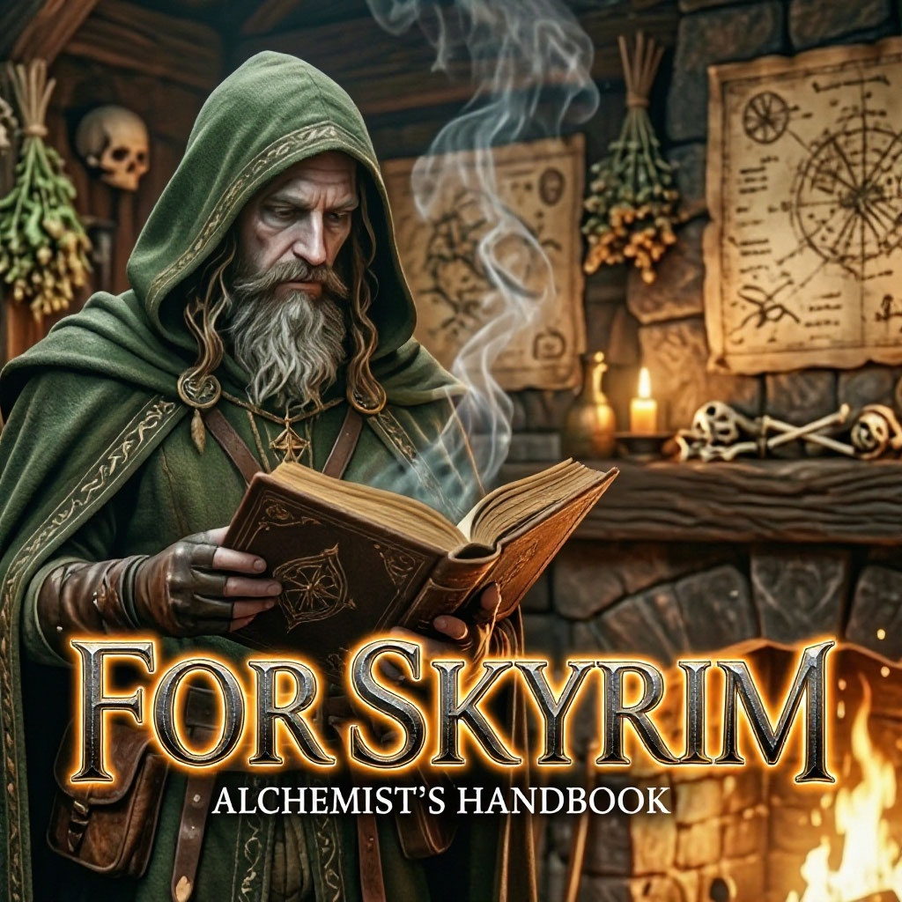

# Справочник алхимика Skyrim

<p align="center">
  
</p>

Настольное приложение-помощник для алхимии в **The Elder Scrolls V: Skyrim**.
Отвечает на вопрос, с которым сталкивается любой игрок за котелком:
*"мне нужен эффект X (или сразу несколько) — из каких ингредиентов его
сварить?"*. Ищет сочетания из 2–3 компонентов по совпадающим свойствам,
показывает состав и описание каждого ингредиента, и позволяет
редактировать базу под себя (свои находки, модифицированные
ингредиенты и т.д.).

База данных приложения покрывает ингредиенты базовой игры, всех
официальных дополнений (Dawnguard, Dragonborn, Hearthfire), надстроек
Saints & Seducers и Plague of the Dead, а также ингредиенты из
популярного мода **Rare Curios**. Интерфейс переведён на 9 языков
(русский, английский, немецкий, испанский, французский, итальянский,
польский, японский, китайский).

Приложение написано на **Tauri 2 + Rust + React + TypeScript + Vite +
Mantine**: вся логика поиска и хранения — на стороне Rust
(`src-tauri/src/db.rs`, чистые функции над SQLite-базой), интерфейс —
веб-страница на React внутри системного WebView (WebView2 на Windows).
Портативно: не требует установки, не пишет в реестр, база и настройки
хранятся рядом с исполняемым файлом.

**Системные требования:** Windows 10/11. Нужен установленный
**WebView2 Runtime** — он идёт предустановленным на
актуальных сборках Windows 10/11; если его нет, приложение подскажет
скачать его с [сайта Microsoft](https://developer.microsoft.com/microsoft-edge/webview2/).

## Авторство и права

**Автор:** Rax_il · © 2026.

**Лицензия:** исходный код распространяется без открытой лицензии — все
права защищены. То, что репозиторий публичный и код можно посмотреть на
GitHub, само по себе не даёт права его копировать, изменять или
распространять — на это нужно отдельное разрешение автора.

**Дисклеймер:** это фанатский инструмент, никак не аффилированный с
Bethesda Softworks. Все права на *The Elder Scrolls V: Skyrim*, его
данные, названия и лор принадлежат Bethesda Softworks LLC. Приложение не
изменяет файлы игры и не требует её наличия — это отдельная справочная
программа, запускается из отдельной директории и работает только в ней.

*This is an unofficial, fan-made tool and is not affiliated with or
endorsed by Bethesda Softworks. All rights to The Elder Scrolls V: Skyrim
and its content belong to Bethesda Softworks LLC.*

## Технологии и структура проекта

- **Frontend:** React 19 + TypeScript + Vite + [Mantine](https://mantine.dev/) UI-kit, `i18next`/`react-i18next` для переводов.
- **Backend:** Rust + [Tauri 2](https://tauri.app/) (десктоп-обвязка вокруг системного WebView), [`rusqlite`](https://docs.rs/rusqlite) с бандленным SQLite-движком (не требует системной библиотеки SQLite на машине пользователя).
- **Хранение данных:** одна SQLite-база (`alchemist.db`), поставляется вместе с приложением уже заполненной.

```
src/                          — фронтенд (React + TS + Mantine)
  App.tsx, main.tsx            — сборка интерфейса, состояние приложения
  components/                  — ControlPanel, TopPane, BottomPane,
                                  EditorModal, SettingsModal, AboutModal,
                                  ThanksModal, HintIcon
  lib/api.ts                   — типизированная обёртка над invoke()
  lib/addons.ts, languages.ts,
  lib/appTheme.ts               — справочники для настроек (источники
                                  данных, языки, темы/масштаб)
  i18n/                         — react-i18next, locales/<lang>/translation.json
                                  для 9 языков

src-tauri/                    — бэкенд (Rust)
  src/db.rs                    — схема БД, поиск сочетаний, CRUD
  src/seed_data.rs,
  src/rare_curios.rs,
  src/creations.rs             — исходные данные (ингредиенты/свойства)
  src/addons.rs                — источники ингредиентов (DLC/моды) и их
                                  включение/выключение
  src/layout.rs                — сохраняемая раскладка окна/панелей
  src/commands.rs               — #[tauri::command]-обёртки над db.rs для React
  src/lib.rs, main.rs           — инициализация приложения
  src/paths.rs                  — alchemist.db и alchemist_settings.json
                                  кладутся рядом с exe (портативность)
  alchemist.db                   — готовая база с картинками и описаниями
```

## Возможности

1. **Поиск сочетаний по свойствам.** Выбираете до 4 нужных эффектов и
   фильтр "Все / Улучшения / Яды" — приложение находит все сочетания
   из 2–3 ингредиентов, дающих эти эффекты, со списком компонентов
   каждого варианта.
2. **Парные сочетания.** Отдельная кнопка: находит пары ингредиентов,
   дающие максимальное количество совпадающих эффектов — без ручного
   выбора конкретных свойств.
3. **Тройные сочетания.** То же самое, но для троек ингредиентов.
4. **Фильтр типа свойств действует и здесь.** Переключатель "Все /
   Улучшения / Яды" из п.1 применяется и к парным, и к тройным
   сочетаниям — можно искать, например, только максимально ядовитые
   пары, не переключаясь обратно на ручной поиск по свойствам.
5. **Просмотр свойств ингредиента.** Выбираете компонент из списка —
   видите все его эффекты, картинку и описание.
6. **Редактор базы.** Добавление, переименование и удаление
   ингредиентов; редактирование их 4 свойств, картинки и описания —
   можно вносить свои находки или правки под изменённые модами
   ингредиенты.
7. **Фильтр по источникам.** В настройках можно включать/выключать
   базовую игру, каждое официальное дополнение, Rare Curios и
   собственные добавленные ингредиенты по отдельности — результаты
   поиска учитывают только включённые источники.
8. **Многоязычный интерфейс.** Полный перевод на 9 языков (русский,
   английский, немецкий, испанский, французский, итальянский,
   польский, японский, китайский) — переключается в настройках без
   перезапуска.
9. **Настройки интерфейса.** Масштаб (мелкий/нормальный/крупный),
   цветовая тема (светлая/тёмная/системная/стилизованная под "Skyrim"),
   ограничение числа отображаемых сочетаний.
10. **Портативность.** Не требует установки, не пишет в реестр — база
    данных и настройки хранятся рядом с исполняемым файлом. Раскладка
    окна (размер, позиция, ширина панелей) запоминается между запусками.

## Сборка из исходников

Сборка под Windows. Ничего сложного: два инструмента поставить один раз,
и дальше пара команд.

### Шаг 1. Поставить инструменты (один раз)

- **Rust** — скачайте и запустите `rustup-init.exe` с [rustup.rs](https://rustup.rs), затем в PowerShell:
  ```powershell
  rustup default stable-msvc
  ```
- **Node.js** 18+ — ставлю обычную LTS-версию с [nodejs.org](https://nodejs.org).

### Шаг 2. Установить зависимости проекта

Из корня проекта:
```powershell
npm install
```

### Шаг 3. Посмотреть вживую (по желанию)

```powershell
npm run tauri dev
```
Открывается окно приложения с hot-reload — правите интерфейс, изменения
подхватываются сразу, пересобирать вручную не нужно.

### Шаг 4. Собрать готовый .exe

```powershell
npm run tauri build
```
Готовый файл — `src-tauri/target/release/alchemist.exe`. Устанавливать
никуда не нужно — это портативный exe, ничего отдельно копировать рядом
с ним тоже не нужно: база данных зашита прямо в бинарник
(`include_bytes!` в `paths.rs`) и разворачивается сама при первом
запуске.

> **Предупреждение Windows при первом запуске.** exe не подписан
> цифровой подписью — SmartScreen (или антивирус) почти наверняка
> покажет предупреждение вида "Windows защитила ваш компьютер" /
> неизвестный издатель. Это нормально для небольших независимых
> приложений без платного сертификата подписи кода — жмите "Подробнее" →
> "Выполнить в любом случае".

### Если собираете на Linux

Разработку самого проекта я веду на Linux, поэтому `npm run tauri dev`
там тоже работает — нужны системные зависимости WebView:
```bash
sudo apt install libwebkit2gtk-4.1-dev build-essential curl wget file \
    libxdo-dev libssl-dev libayatana-appindicator3-dev librsvg2-dev
```
А чтобы собрать именно Windows-`.exe`, не переключаясь на саму Windows,
использую кросс-компиляцию через `cargo-xwin` (эмулирует MSVC-линковщик,
сам подтягивает нужные библиотеки Windows SDK):
```bash
rustup target add x86_64-pc-windows-msvc
cargo install cargo-xwin
npm install
npm run build                 # сначала собрать фронтенд (dist/)
cd src-tauri
cargo xwin build --release --target x86_64-pc-windows-msvc
```
Готовый файл — `src-tauri/target/x86_64-pc-windows-msvc/release/alchemist.exe`.
Если `cargo xwin` даст сбой — это известное больное место кросс-сборки
Tauri, не тратьте на него время, соберите прямо на Windows (Шаг 1–4
выше) или через GitHub Actions с `windows-latest` раннером.
