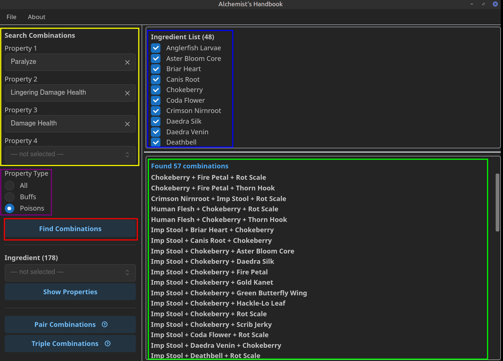
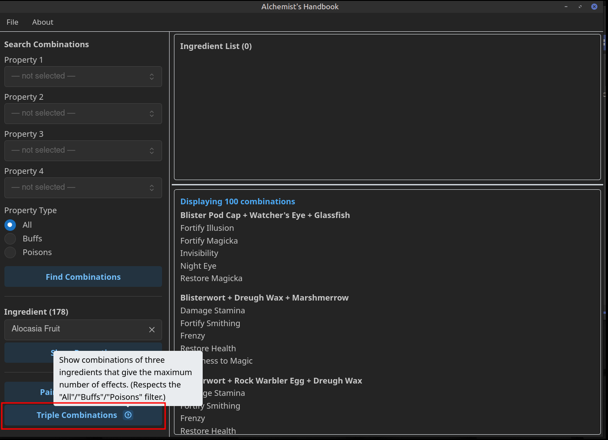
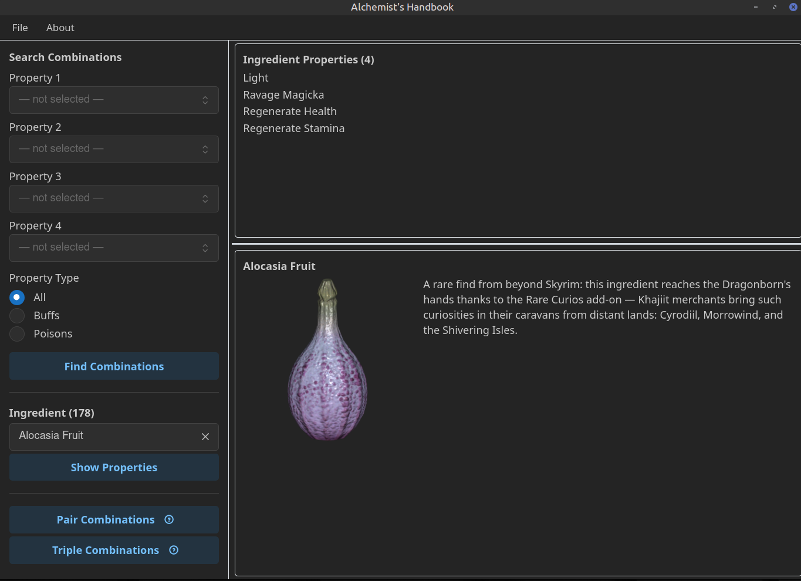
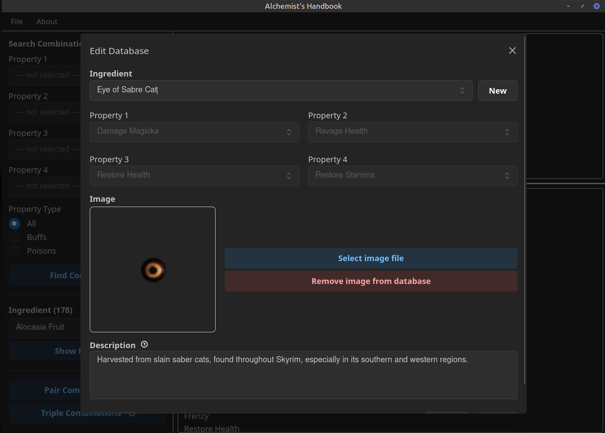
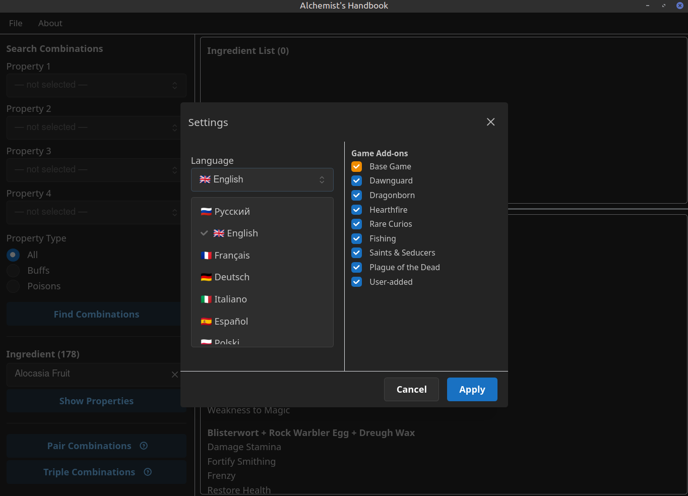
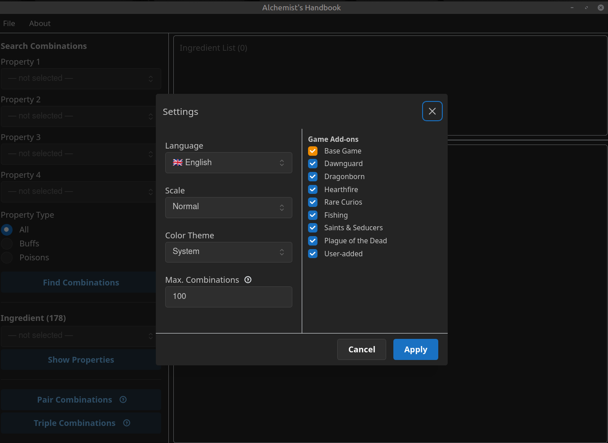

# Черновик страницы на NexusMods

Русский черновик для согласования. После правок — переводим в финальный
BBCode для полей "Description" и "Permissions and Credits" на сайте.

---

## Description

# Справочник алхимика Skyrim

Настольное приложение-помощник для алхимии в *The Elder Scrolls V: Skyrim*.

## Описание

Полностью независимое от игры приложение позволяет получить все возможные комбинации алхимических ингредиентов для получения зелья с заданными свойствами, а также является справочником по свойствам всех ингредиентов Skyrim, существующих как в базовой версии игры, так и в официальных дополнениях Dawnguard, Dragonborn, Hearthfire и т.д. С помощью настроек Вы можете управлять списком активных источников, чтобы исключать лишние ингредиенты из подбора комбинаций, если у Вас их нет.

Интерфейс полностью переведён на 9 языков: русский, английский, немецкий, испанский, французский, итальянский, польский, японский и китайский. В переводах использованы формулировки из официальных локализаций игры.

База данных приложения редактируема: вы можете менять описание и изображения ингредиентов, добавлять новые ингредиенты, чтобы они участвовали в поиске комбинаций для зелий.

## Возможности

- **Поиск сочетаний по свойствам.** Выбираете до 4 нужных эффектов и
  фильтр (Все / Улучшения / Яды) — получаете все подходящие сочетания
  из 2–3 ингредиентов.
- **Лучшие пары / лучшие тройки.** Одна кнопка находит пары или тройки
  ингредиентов с максимальным числом совпадающих эффектов — без ручного
  выбора конкретных свойств.
- **Просмотр ингредиента.** Выбираете компонент из списка — видите все
  его эффекты, картинку и описание.
- **Редактируемая база.** Добавление, переименование и удаление
  ингредиентов; редактирование их 4 свойств, картинки и описания —
  можно вносить ингредиенты из новых модов или правки в описание существующих ингредиентов на свое усмотрение.
- **Отключаемые источники.** Базовую игру, каждое официальное
  дополнение, Rare Curios и собственные добавленные ингредиенты можно
  включать/выключать по отдельности — поиск учитывает только включённые
  источники.
- **Интерфейс на 9 языках**, переключается в настройках без
  перезапуска.
- **Настройки интерфейса.** Масштаб (мелкий/нормальный/крупный),
  цветовая тема (светлая/тёмная/системная/стилизованная под "Skyrim"),
  ограничение числа отображаемых сочетаний.
- **Полная портативность.** Не требует установки, не пишет в реестр —
  база данных и настройки хранятся рядом с исполняемым файлом.
  Раскладка окна (размер, позиция, ширина панелей) запоминается между
  запусками.

## Как пользоваться

### 1. Поиск сочетаний по свойствам

Выберите до 4 нужных эффектов (**жёлтая рамка**) и фильтр типа свойств
— All / Buffs / Poisons (**фиолетовая рамка**), затем нажмите **Find
Combinations** (**красная рамка**). Справа появится список подходящих
ингредиентов (**синяя рамка**) и все сочетания из 2–3 компонентов,
дающие выбранные эффекты (**зелёная рамка**). Каждый ингредиент в этом
списке можно включить или выключить отдельным чекбоксом, чтобы точнее
настроить список сочетаний — удобно, например, если какого-то
ингредиента у вас пока нет: снимите галочку, и поиск перестанет
предлагать варианты с ним.

### 2. Лучшие пары и тройки одним кликом

Кнопки **Pair Combinations** и **Triple Combinations** (**красная
рамка**) сразу находят сочетания с максимальным числом совпадающих
эффектов — без ручного выбора конкретных свойств. Наведите на значок
(i) рядом с кнопкой, чтобы увидеть подсказку с описанием.

### 3. Информация об ингредиенте

Выберите ингредиент из списка и нажмите **Show Properties** — справа
появятся его 4 свойства, изображение и описание.

### 4. Редактирование базы

В меню **File → Edit Database** можно добавить новый ингредиент,
изменить его свойства, картинку и описание — удобно для внесения
собственных находок или правок под изменённые модами ингредиенты.

### 5. Смена языка интерфейса

В **Settings** выберите нужный язык из списка — интерфейс переключится
мгновенно, без перезапуска приложения.

### 6. Управление источниками ингредиентов

Там же, в **Settings**, можно включить или выключить каждый источник
ингредиентов по отдельности (базовая игра, официальные дополнения,
Rare Curios, добавленные вручную) — поиск учитывает только включённые
источники.

## Системные требования

Windows 10/11, с установленным [WebView2
Runtime](https://developer.microsoft.com/microsoft-edge/webview2/) (уже
идёт предустановленным на актуальных сборках Windows 10/11 — если его
нет, приложение само подскажет, откуда скачать).

## Установка

Установщик не нужен — скачайте архив, распакуйте куда угодно и
запустите .exe. База данных ингредиентов зашита прямо в исполняемый
файл, копировать рядом с ним больше ничего не нужно.

**Предупреждение:** exe не подписан цифровой подписью, поэтому Windows
SmartScreen (или антивирус) почти наверняка покажет предупреждение
вида "неизвестный издатель" при первом запуске. Это нормально для
небольших независимых приложений без платного сертификата подписи кода
— нажмите "Подробнее" → "Выполнить в любом случае".

## Исходный код

Полный исходный код доступен на GitHub:
[github.com/Rax-il/skyrim-alchemist-handbook](https://github.com/Rax-il/skyrim-alchemist-handbook)
(опубликован для прозрачности — условия использования см. на вкладке
Permissions).

## Дисклеймер

Это фанатский инструмент, никак не аффилированный с Bethesda Softworks.
Все права на *The Elder Scrolls V: Skyrim*, его содержимое и лор
принадлежат Bethesda Softworks LLC. Приложение не изменяет файлы игры
и не требует её наличия — это отдельная справочная программа,
запускается из собственной папки и работает только в ней.

---

## Permissions and Credits

**Автор:** Rax_il

**Права использования:** все права защищены. Исходный код опубликован
на GitHub исключительно для прозрачности — это не даёт права
копировать, изменять, распространять или перезаливать это приложение
или его базу данных, полностью или частично, без явного разрешения
автора.
